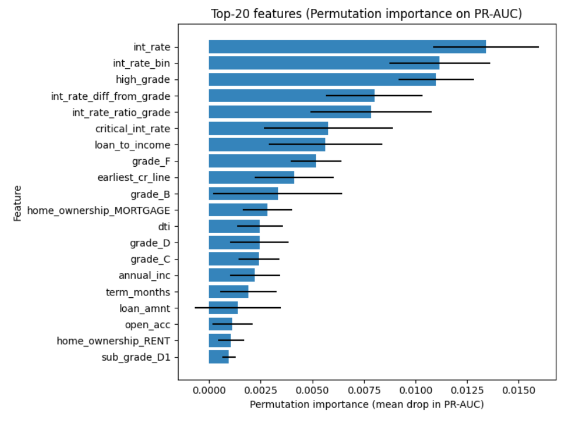
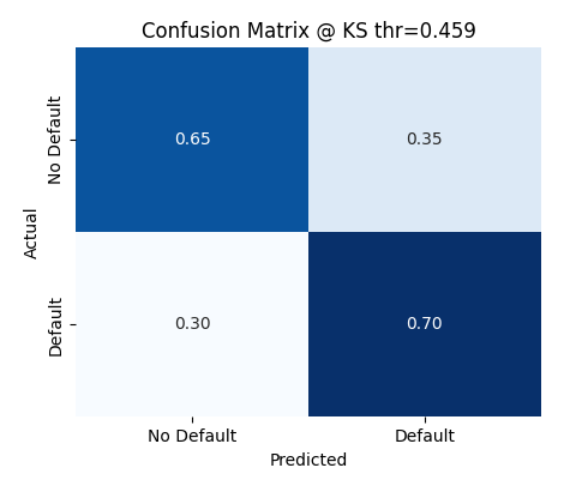
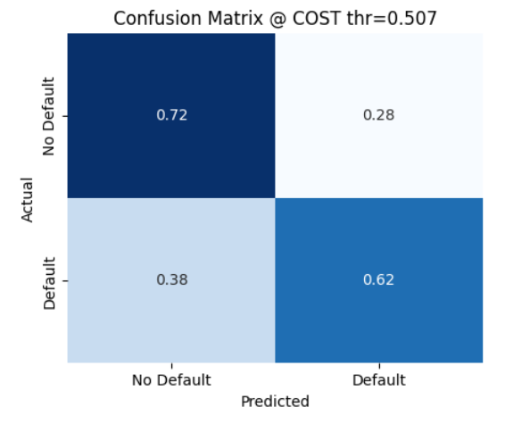
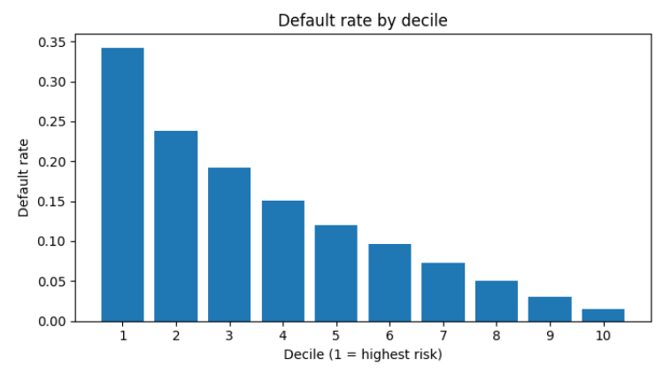
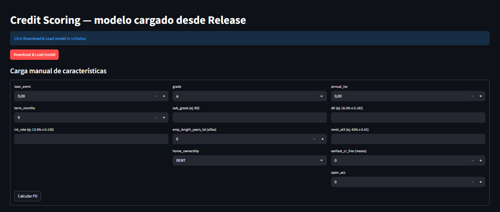

# Credit Scoring — Lending Club Model

A data science project focused on credit risk modeling using the Lending Club dataset.
This repository develops, evaluates, and deploys machine learning models that predict loan default probability and translate it into an interpretable credit score.

## Objective

The goal of this project is to build a reliable credit scoring model that can:

* Predict the probability of default for a given borrower.

* Convert probabilities into an interpretable scoring scale.

* Evaluate multiple models and select the most robust one.

* Provide a reproducible and transparent pipeline from raw data to prediction.

Ultimately, this project aims to combine data science and finance to support better credit decisions.

##  Project Structure
```
.
├── app/                # Streamlit web app (UI + inference + feature engineering)
├── notebooks/          # Jupyter notebooks for EDA and experiments
├── sql/                # SQL queries for cleaning
├── .devcontainer/      # VS Code container setup
├── requirements.txt    # Dependencies
├── runtime.txt         # Runtime version for hosting
└── README.md
```
## Data Cleaning (SQL)

The SQL scripts in this project handle the complete preprocessing of the Lending Club dataset before model training.

**Main steps:**
- **Exploration and null check:** counted loans per status and inspected missing values across all columns.  
-  **Target creation:** defined a binary `default_status` column (`1` for defaulted/charged-off loans, `0` otherwise).  
-  **Type casting and normalization:** converted string values into numeric formats (e.g., `int_rate`, `dti`, `revol_util`, `term_months`), standardized employment length, and casted dates properly.  
-  **Imputation:** replaced missing `dti` and `revol_util` values using the median of each credit grade.  
-  **Feature selection:** kept only relevant variables (loan amount, term, income, credit age, etc.) and dropped incomplete rows.  
-  **Final table:** created `loans_cleaned`, ready for feature engineering and machine learning pipelines.


## Features and Feature Engineering

### Main Features Used

The model was trained on a larger set of variables from the Lending Club dataset, but the following represent the most important features contributing to credit risk prediction.
They capture the borrower’s financial profile, credit quality, and loan characteristics:

* `grade` – borrower’s credit grade (A–G), categorical indicator of credit quality.

* `annual_inc` – annual income declared by the borrower.

* `loan_amnt` – total amount requested for the loan.

* `int_rate` – nominal interest rate applied to the loan.

* `dti` – debt-to-income ratio, a measure of the borrower’s leverage.

* `earliest_cr_line` – date of the borrower’s first credit line, used to estimate credit experience.

These core variables represent the financial foundation of the model, providing the essential information about income, debt, pricing, and credit history that determines the risk of default.

### Engineered Features

Several additional features were created to enhance model robustness and interpretability.
These transformations were designed to stabilize relationships and reduce noise from raw financial variables:

* `loan_to_income` – ratio of loan amount to annual income; highlights relative debt burden.

* `high_grade` – binary indicator set to 1 if the grade is higher than “D”, distinguishing prime from subprime borrowers.

* `dti_bin` – binned version of the DTI ratio, improving monotonicity and reducing sensitivity to outliers.

* `int_rate_bin` – discretized version of the interest rate, grouping loans by rate ranges.

* `grade_avg_int` – average interest rate by grade, used to handle missing or inconsistent rate values.

* `credit_age_months` – credit history length in months, computed from earliest_cr_line.

After applying the engineered features, the model showed a clear improvement in predictive performance compared to the baseline model:

* **ROC-AUC improved from 0.726 to 0.739**
* **PR-AUC improved from 0.281 to 0.288**

These gains confirm that the engineered features slightly increased model discrimination and precision.



**Figure:** Feature importance of the final model, showing `grade`, `loan_to_income`, and `dti_bin` as the strongest predictors.

## Modeling

To speed up iterative modeling (not the app), a smaller working subset of the dataset was created and split into train/validation. We evaluated two tree-based algorithms:

- **Random Forest (RF)**
- **XGBoost (XGB)**

RF delivered the best validation performance, so we ran a grid search for hyperparameter tuning. The tuned RF achieved:

- **ROC-AUC:** 0.739 (~0.74)
- **PR-AUC:** 0.288

After selection, the final RF was retrained on the **full dataset** (train + validation) for deployment.

### Best hyperparameters (from Grid Search)

- `n_estimators`: **500**
- `max_depth`: **None**
- `min_samples_split`: **25**
- `min_samples_leaf`: **25**
- `max_features`: **`"sqrt"`**
- `class_weight`: **`"balanced"`**

## Threshold Analysis (Full Model)

We evaluated operating thresholds using three objective functions on the **full model**:

- **F1-optimal threshold:** τ = **0.527**  *(F1 = 0.3587)*
- **KS-optimal threshold:** τ = **0.459**  *(KS = 0.3527)*
- **Cost-minimizing threshold:** τ = **0.507**  *(Cost = 221,172; weights: cost_fn = 5.0, cost_fp = 1.0)*

Below are the **row-normalized** confusion matrices at each operating point (Actual on rows, Predicted on columns):

- **@ F1 τ=0.527** → TNR **0.75**, FPR **0.25**; TPR **0.58**, FNR **0.42**
- **@ KS τ=0.459** → TNR **0.65**, FPR **0.35**; TPR **0.70**, FNR **0.30**
- **@ COST τ=0.507** → TNR **0.72**, FPR **0.28**; TPR **0.62**, FNR **0.38**

The choice of threshold depends on business goals:
- **F1** balances precision/recall,
- **KS** maximizes separation (TPR − FPR),
- **Cost** minimizes expected losses under the specified misclassification costs.






## Decile & Cumulative Analysis

We validate the model’s ranking power by sorting applicants by predicted PD and analyzing two diagnostics.

**1) Default rate by decile (Decile 1 = highest risk)**
- Bars show the observed default rate within each decile.
- A clean, monotonic increase toward Decile 1 indicates that higher-scored applicants truly default more often.
- Use this chart to verify stability: if the shape is noisy or non-monotonic, binning/regularization may be needed.



**2) Cumulative gains curve**
- X-axis: cumulative share of the population (sorted from highest to lowest risk).
- Y-axis: cumulative share of all defaults captured up to that cutoff.
- The steeper the curve above the dashed random baseline, the better the model concentrates “bads”.
- Practical read: pick a cutoff (e.g., top 20% by risk) and read how many defaults you capture at that point.


##  App

This repository includes a Streamlit app that serves the final credit-scoring model and the same preprocessing used during modeling.

### How to run it (terminal)

```
# 1) Create & activate a virtual env
python -m venv .venv
# Windows: .venv\Scripts\activate
source .venv/bin/activate

# 2) Install dependencies
pip install -r requirements.txt

# 3) Launch the app
streamlit run app/streamlit_app.py
```

The app downloads the serialized model from the GitHub Release (e.g., v1.0.0) on first run.



## ✅ Conclusion

This project delivers a production-ready credit scoring pipeline that is both interpretable and effective:

- A tuned **Random Forest** (trained on the full dataset) outperformed the baselines after feature engineering, with **ROC-AUC improving from 0.726 → 0.739** and **PR-AUC from 0.281 → 0.288**.
- Three operating thresholds were evaluated on the full model (**F1**, **KS**, and **Cost**), allowing the business to pick the trade-off that best matches its objectives.
- **Decile analysis** shows a clean monotonic default pattern (Decile 1 = highest risk), and **cumulative gains** curve sits clearly above the random baseline, confirming strong ranking power.
- A **Streamlit app** reproduces the exact preprocessing and model used in modeling, enabling CSV batch scoring and manual what-if analysis for stakeholders.

## Data Source

This project uses the public **Lending Club Loan Data** for educational and research purposes.

- **Source:** Lending Club Loan Data (e.g., Kaggle mirror: https://www.kaggle.com/datasets/wordsforthewise/lending-club)
- **Notes:** The dataset is anonymized and intended for analysis. Please review the dataset’s original terms of use. Do not attempt to re-identify individuals or use the model for real lending decisions without proper governance, calibration, and regulatory review.


## Contact

**Author:** Baltazar Salvatierra  
**GitHub:** [@BSalvatierra13](https://github.com/BSalvatierra13)  
**Email:** *salvatierra.baltazar@gmail.com*  
**LinkedIn:** [Baltazar Salvatierra](https://www.linkedin.com/in/baltazar-salvatierra-67a452203/)


*Questions, issues, or collaboration proposals are welcome. Open an issue or reach out directly.*
